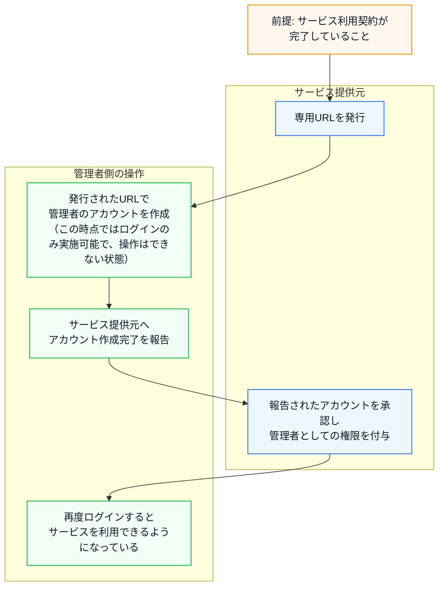

# LoopLive 操作手順書

LoopLive Web アプリの操作手順を、管理者向けとユーザー向けの2ページ構成で定義する。

## サービスが利用できるようになるまで

### 補足（ユーザーアカウント運用）

- ユーザーを追加する場合は、発行済みURLをユーザーへ共有してアカウントを作成してもらい、管理者が `ユーザー管理` 画面で承認（権限付与）する。
- ユーザーが離任した場合は、管理者がユーザーアカウントを停止または削除できる。

---

## A. 管理者向け手順書（`docs/admin.html` 想定）

### A-1. 初期設定（管理者）

#### A-1-1. 目標

- 管理者自身のアカウントを作成できる
- サービス提供元による有効化待ちまで完了できる

#### A-1-2. 手順

`docs/admin.html`「1. 初期設定」と同一の流れです。

| No | 画面 | 操作 | 結果確認 |
|---:|---|---|---|
| 1 | ログイン画面 | LoopLive にアクセスし、`アカウント作成` タブを選択する | サインアップ画面が表示される（キャプチャ: `guide1-01-access-signup.png`） |
| 2 | サインアップ | 利用規約をスクロールし、`同意する` を押す | 規約確認後に同意できる（`guide1-02-terms-scroll.png` → `guide1-03-agree-terms.png`） |
| 3 | サインアップ | `Email` と `パスワード` を入力し、`アカウントを作る` を押す | アカウントが作成される（`guide1-04-email-password.png` → `guide1-05-create-account.png`） |

**補足（手順書の「運用 / 有効化待ち」カード）**: アカウント作成後は、サービス提供元に連絡し、有効化されるまで待ってください。有効化完了後に利用開始できます。

### A-2. 配信者を追加する（管理者）

#### A-2-1. 目標

- 配信者がアカウント作成できる
- 管理者が配信者に必要な権限と顔画像設定を反映できる

#### A-2-2. 手順

`docs/admin.html`「2. 配信者を追加する」と同一の流れです。

| No | 画面 | 操作 | 結果確認 |
|---:|---|---|---|
| — | （前提・手順書の補足カード） | 配信者に「A-1 初期設定」と同様の手順でアカウント作成してもらう | 配信者アカウントが作成される |
| 1 | `PortalPage` | `ユーザーを管理する` を押す | `UserManagementPage` が表示される（`guide1-06-user-mgmt.png`） |
| 2 | `UserManagementPage` | 対象カードをクリックし、`編集` を押す | ユーザー編集へ（`guide1-07-user-card.png` → `guide1-08-user-detail-edit.png`） |
| 3 | `ユーザー編集` | `権限`（[権限の一覧](#c-2-ロールと行える操作)）と顔画像（`source_file`）を設定し、`更新` を押す | 配信者の設定が保存される（`guide1-09-role.png` → `guide1-10-update-user.png`） |

### A-3. 写真フェイススワップ（管理者）

#### A-3-1. 目標

- `フェイススワップする` が完了し、`処理履歴` に `完了` が表示される
- `結果` を `ダウンロード` できる

#### A-3-2. 手順

`docs/admin.html`「3. 写真フェイススワップ」と同一の流れです。

| No | 画面 | 操作 | 結果確認 |
|---:|---|---|---|
| 1 | `PhotoFaceSwapPage` | `元の顔を選択` と `なりたい顔を選択` で画像（JPG/PNG）をアップロード | プレビューが表示される（`guide3-01-face-a.png` / `guide3-02-face-b.png`） |
| 2 | `PhotoFaceSwapPage` | `フェイススワップする` を押し、確認ダイアログで `はい` を押す | 処理が開始される（`guide3-03-swap-start.png` → `guide3-04-confirm.png`） |
| 3 | `PhotoFaceSwapPage` | `処理履歴` が `完了` になるまで待ち、`結果` をダウンロード（PC: 下矢印 / スマホ: `ダウンロード`） | 結果画像が表示または保存される（`guide3-05-history-pending.png` → `guide3-06-history-done.png`） |

### A-4. 利用料金を確認する（管理者）

#### A-4-1. 目標

- 対象月の利用時間・請求金額を確認できる
- サーバー別の起動/停止履歴を確認できる

#### A-4-2. 手順

`docs/admin.html`「4. 利用料金を確認する」と同一の流れです。

| No | 画面 | 操作 | 結果確認 |
|---:|---|---|---|
| 1 | `PortalPage` | `サーバー使用料を見る` を押す | `UsageBillingPage` が表示される（`guide4-01-billing-link.png`） |
| 2 | `UsageBillingPage` | `合計利用時間` / `合計請求金額`、明細行を確認する（対象月は矢印で切替） | 月次の合計が確認できる（`guide4-02-total-hours.png`） |
| 3 | `UsageBillingPage` | 利用履歴ダイアログ（明細行クリック等）と `フォトスワップ使用` を確認する | 起動/停止履歴・枚数が確認できる（`guide4-03-history-dialog.png`） |

### A-5. ユーザー情報を変更する（管理者）

#### A-5-1. 目標

- ユーザーの検索・編集・削除ができる

#### A-5-2. 手順

`docs/admin.html`「5. ユーザー情報を変更する」と同一の流れです。

| No | 画面 | 操作 | 結果確認 |
|---:|---|---|---|
| 1 | `PortalPage` | `ユーザーを管理する` を押す | `UserManagementPage` が表示される（`guide4-04-user-mgmt.png`） |
| 2 | `UserManagementPage` | 検索欄に条件を入力し、対象カードを選択する | 一覧が絞り込まれる（`guide4-05-search.png`） |
| 3 | `ユーザー詳細`〜`ユーザー編集` | `編集` を押し、`ユーザー名` / `Email` / `パスワード` / `権限` を必要に応じて更新して `更新` を押す | ユーザー一覧に反映される（`guide4-07-edit-user.png` → `guide4-08-update.png`） |
| 4 | `ユーザー詳細` | `削除` を押し、確認ダイアログで `はい` を押す | ユーザーが一覧から消える（`guide4-09-delete.png`） |

---

## B. ユーザー向け手順書（`docs/user.html` 想定）

### B-1. アカウント作成方法（ユーザー）

#### B-1-1. 目標

- ユーザーが自身のアカウントを作成できる

#### B-1-2. 手順

`docs/user.html`「1. アカウントを作る」と同一の流れです。

| No | 見出し（手順書） | 画面 | 操作 | 結果確認 |
|---:|---|---|---|---|
| 1 | アクセスとアカウント作成タブ | ログイン画面 | LoopLive にアクセスし、`アカウント作成` タブを選択する | サインアップ画面が表示される（`guide1-01-access-signup.png`） |
| 2 | 利用規約をスクロール | サインアップ | 利用規約を最下部までスクロールする | `同意する` が有効化される（`guide1-02-terms-scroll.png`） |
| 3 | 同意する | 利用規約 | `同意する` を押す | サインアップ入力フォームが表示される（`guide1-03-agree-terms.png`） |
| 4 | Email / パスワード入力 | サインアップ | `Email` と `パスワード` を入力する | 入力が受け付けられる（`guide1-04-email-password.png`） |
| 5 | アカウントを作る | サインアップ | `アカウントを作る` を押す | アカウントが作成される（`guide1-05-create-account.png`） |

**補足（手順書の補足カードと同じ）**: アカウントを作成しただけでは使用可能になりません。管理者にアカウントの有効化（権限設定）を依頼してください。

### B-2. リアルタイム加工（ユーザー）

#### B-2-1. 目標

- `加工開始` から `加工停止` まで実行できる
- 必要に応じて `加工後の映像を見る` で出力を確認できる

**注意（`docs/user.html`）**: スマホ版ではリアルタイム加工を利用することはできません。

**大まかな流れ（手順書の図と同じ）**: 顔交換サーバー起動 → OBSと連携 → カメラ映像取り込み → 顔交換加工

#### B-2-2. 手順

`docs/user.html`「2. リアルタイム加工」の見出し・操作・結果確認に合わせています（キャプチャは `docs/assets/guides/` 配下）。

| No | 見出し（手順書） | 画面 | 操作 | 結果確認 |
|---:|---|---|---|---|
| 1 | ポータル — 加工を始める | `PortalPage` | `加工を始める` を押す | `サーバー管理`（`InstanceDashboard`）が表示される（`guide2-01-start-streaming.png`） |
| 2 | サーバー管理 — 入室 | `InstanceDashboard` | 対象サーバーで `入室` を押す | `StreamingPage`（リアルタイム加工）が開く（`guide2-02-enter-room.png`） |
| 3 | サーバー起動（必要な場合） | `StreamingPage` | サーバー状態が `OFF` / `起動失敗` のとき `起動する` を押す | 確認ダイアログが表示される（`guide2-03-start-server.png`） |
| 4 | 起動確認ダイアログ | 確認ダイアログ | `はい` を押す | `サーバーを起動しています。このままお待ちください...` が表示される（`guide2-04-confirm-start.png` / `guide2-04-startup-in-progress.png`） |
| 5 | 準備完了まで待つ | `StreamingPage` | サーバー状態が `準備完了` になるまで待つ | `カメラに接続` が押せる状態（`guide2-05-server-ready.png`） |
| 6 | カメラに接続 | `StreamingPage` | `カメラに接続` を押す | プレビューにカメラ映像（`guide2-06-camera-connect.png`） |
| 7 | カメラの選択 | `StreamingPage` | 必要に応じて `カメラ` を選び直す | 映像が切り替わる（`guide2-07-camera-select.png`） |
| 8 | 鼻下加工 | `StreamingPage` | 必要に応じて鼻下加工を切り替える | 表示が切り替わる（`guide2-08-nose-toggle.png`） |

**鼻下加工とは（手順書の説明と同じ）**: 鼻から下半分（口周りや輪郭含め）の顔交換の有効/無効を選択できる機能です。マスクをする場合や口周りのみ本人の顔を使用したい場合に ON にすることで、AI の加工による顔崩れを防げます。

| No | 見出し（手順書） | 画面 | 操作 | 結果確認 |
|---:|---|---|---|---|
| 9 | WebSocket の有効化とパスワード発行（OBS側） | OBS Studio | OBS を起動し、WebSocket サーバーを有効にし、`サーバーパスワード` を発行してコピーする | 参考: [OBS WebSocket の設定方法（外部）](https://help.alive-project.com/hc/ja/articles/38077288641555-OBS-WebSocket%E3%81%AE%E8%A8%AD%E5%AE%9A%E6%96%B9%E6%B3%95) |

手順9のアコーディオンと同内容: OBS WebSocketサーバー設定の仕方（WebSocket設定1〜3）

以下の画像の手順に従ってください。OBS のバージョンが異なる場合、画面が異なる場合があります。その場合はインターネットで「OBS WebSocketパスワード設定」等で検索ください。

- `guide2-09-obs-websocket-setup-1.png`
- `guide2-09-obs-websocket-setup-2.png`
- `guide2-09-obs-websocket-setup-3.png`

| No | 見出し（手順書） | 画面 | 操作 | 結果確認 |
|---:|---|---|---|---|
| 10 | OBS WebSocket パスワード | `StreamingPage` | `OBS WebSocketパスワード` 欄に、手順9で発行したサーバーパスワードを入力する | LoopLive→OBS Studio へ映像を連携するために必要なパスワードが設定される（`guide2-10-obs-ws-password.png`） |
| 11 | OBS 連携の設定 | `StreamingPage` | `OBS連携` 欄の設定を必要に応じて変更する（マイクの遅延、ネットワークバッファリング、出力ストリームのレイテンシなど） | —（`guide2-11-obs-link-settings.png`） |

手順11のアコーディオンと同内容: 設定のポイント（マイク遅延・ネットワーク・レイテンシ）

| 設定項目 | 解説 | おすすめの設定 |
|---|---|---|
| マイクの遅延（同期オフセット） | 映像とマイク音声のズレを調整する値です。数値を大きくすると「音声を遅らせる」方向に働きます。 | まずは 1.0秒～3.0秒の間で確認し、口パクより音声が早い場合は +0.1〜+0.3秒 ずつ増やして調整します。一度加工を開始した後は OBS Studio 側のマイク設定から調整をしてください。 |
| ネットワークバッファリング | 受信した映像を一時的にバッファして途切れにくくする機能です。数値を大きくすると安定性が増す一方で、遅延も増えます。 | 映像が頻繁に途切れる場合は一度加工処理を止めた後、この数値を少し増やしてリトライしてください。 |
| 出力ストリームのレイテンシ | OBS から視聴者へ映像が届くまでの遅延量に関わる設定です。低遅延にするほどインタラクティブになりますが、回線の余裕が必要です。 | 0.5秒でまずは設定し、映像の乱れなどが気になり安定性を最優先したい場合は一度加工処理を止めた後、この数値を少し増やしてリトライしてください。 |

| No | 見出し（手順書） | 画面 | 操作 | 結果確認 |
|---:|---|---|---|---|
| 12 | OBS にメディアソースを追加 | `StreamingPage` / OBS | `OBSにメディアソースを追加` を押し、OBS の `ソース` 欄に `LoopLiveからの映像` が追加されたことを確認する | OBS Studio が起動していることが必須。パスワードのダイアログが出たら `はい` を選んで保存しておくと便利（`guide2-12-obs-add-media-source.png` / `guide2-12-obs-add-success.png` / `guide2-12-obs-password-save-dialog.png`） |

よくあるエラー（手順12のアコーディオンと同内容）

| エラー文 | 想定される原因 | どうすればいいか |
|---|---|---|
| 再生用のURLが指定されていません。 | 配信準備が済む前に操作した、サーバー側で URL が未設定など。 | サーバーが起動してしばらくしてから操作する。 |
| OBSからシーンリストを取得できませんでした。 | OBS にシーンが1つも設定されていない。 | OBS でシーンを少なくとも1つ作成してから再試行する。 |
| 最後のシーンの名前が取得できませんでした。 | まれに起こる。 | まれなケース。OBS を再起動し、再度同じ手順を実施する。 |
| OBSのWebSocketパスワードが正しくありません。 | OBS 側の WebSocket 認証と、LoopLive に入力したパスワードが一致しない。 | OBS の「設定」→「WebSocket サーバー」のサーバーパスワードと、入力した `OBS WebSocketパスワード` を一致させる。 |
| OBS WebSocketパスワードは必須です。 | パスワードが記入されていない。 | LoopLive にパスワードを入力する。 |
| OBSがリクエストを無効と判断しました。OBS側の環境に問題がある可能性があります。 | OBS側の不具合。 | OBS のバージョンを確認・更新する。OBS を再起動し、プラグインの影響を疑う。 |
| OBSに接続できません。OBSが起動しているか、WebSocketサーバー設定を確認してください。 | OBSに接続失敗している。 | 同一 PC で OBS Studio を起動する。OBS の WebSocket サーバーを有効にし、既定のポート **4455** で待ち受けているか確認する。ファイアウォールやセキュリティソフトの設定が妨害していないかを確認する。ポート **4455** を別アプリが使用していないかを確認する。 |
| 予期せぬエラーが発生しました。詳細はコンソールを確認してください。 | 上記の個別分岐に当てはまらない例外。 | 開発元へ相談する。 |

**補足（エラーではないが表示されうるメッセージ）**

| 表示 | 想定される原因 | どうすればいいか |
|---|---|---|
| ソースは設定しましたが、マイクの遅延設定には失敗しました。 | 映像の受信設定は成功しているが、 `マイク` が OBS に存在しないため設定に失敗した。 | OBS のマイクの名を `マイク` に修正し再度ボタンを押す。 |

| No | 見出し（手順書） | 画面 | 操作 | 結果確認 |
|---:|---|---|---|---|
| 13 | 加工開始 | `StreamingPage` | `加工開始` を押す | 確認ダイアログが表示される（`guide2-13-process-start.png`） |

うまくいかないとき（加工開始〜加工が始まるまで）（手順13のアコーディオンと同内容）

**ボタンが押せない・灰色のまま**

| 状況 | 想定される原因 | どうすればいいか |
|---|---|---|
| `加工開始` が押せない | カメラがまだ接続されていない。 | 手順6まで戻り、`カメラに接続` からプレビューが出る状態にする。 |
| 同上 | サーバーの状態が「準備完了」ではない（起動処理中・準備中・停止処理中・オフなど）。 | 手順3〜5のとおり、起動が完了して **準備完了** になるまで待つ。 |

**メッセージが出る場合（通知など）**

| 目安となる表示 | 想定される原因 | どうすればいいか |
|---|---|---|
| カメラまたはサーバー接続情報がありません。 | カメラ映像の取得が無い、またはサーバー側の接続先情報がまだ画面に揃っていない。 | `カメラに接続` をやり直す。ページを再読み込みし、**準備完了** を確認してから再度 `加工開始` する。 |
| サーバーへの接続に失敗しました（のあとに英語や数字が続くことがある） | ブラウザからサーバーへの最初の接続確立に失敗した。 | 通信環境を確認する。時間を置いて再試行する。VPN・プロキシ・企業ネットワークの制限も疑う。 |
| サーバーとの接続が確立しました。加工の処理を開始します…（のち長く待つ） | 接続はできたが、サーバー側で加工用の映像出力の準備に時間がかかっている。 | **数分待つ**ことがある。エラーではない場合が多い。 |
| 加工処理中… ／ 接続中… が長い | 上記の準備待ち、または通信が遅い。 | 待つ。5分近く待っても進まない場合は、下のタイムアウトや接続切れを参照。 |
| 加工処理がタイムアウトしました（300秒）。 | 約5分以内に加工の準備完了にならなかった。 | `加工停止` でいったん止め、ネットワークとサーバー状態を確認してからやり直す。改善しない場合はサービス提供元に相談する。 |
| サーバー状態の確認に失敗しました。 | 加工準備が整ったかどうかの確認の通信に失敗した。 | 通信を確認し、ページを再読み込みしてからやり直す。 |
| サーバーとの接続が切れました。 | 通信が途中で切断された。 | ネットワークを確認し、あらためて `加工開始` から試す。 |
| サーバー情報の更新に失敗しました。 | 画面の裏側でサーバー情報の取得に失敗した（加工中以外でも出うる）。 | 通信を確認。繰り返す場合はページを再読み込み。 |

**エラーが出なくても起きうること**

| 状況 | 想定される原因 | どうすればいいか |
|---|---|---|
| `はい` を押したあと **準備完了** のままに見える／すぐには進まない | 表示の更新タイミングや、サーバー側の処理待ち。 | しばらく待つ。手順書「補足（所要時間）」も参照。 |
| `加工処理中…` のあとも OBS にすぐ映らない | 本画面で加工が始まっても、OBS 側に映像が届くまで追加で時間がかかる。 | 数十秒〜1分程度待つ（手順15の説明どおり）。 |

| No | 見出し（手順書） | 画面 | 操作 | 結果確認 |
|---:|---|---|---|---|
| 14 | 加工開始の確認 | 確認ダイアログ | `はい` を押す | `加工処理中…`（または一時的に `接続中...`）（`guide2-14-confirm-process.png` / `guide2-14-processing-in-progress.png`） |
| 15 | 加工の成功確認 | `StreamingPage` | `使用中` が表示されれば成功 | 加工開始後、およそ数十秒〜1分程度で OBS Studio にも映像が映る（`guide2-15-processing.png`） |

手順15のアコーディオンと同内容: 映像と音声にズレが生じる場合（OBS で同期オフセットを調整）

OBS 側で音声を早めたり遅らせたりすることで、映像に音声を合わせるように調整します。例えば映像が音声よりも1秒早い場合は `1000ms` と入力する。

- `guide2-15-obs-volume-settings-1.png`
- `guide2-15-obs-volume-settings-2.png`

| No | 見出し（手順書） | 画面 | 操作 | 結果確認 |
|---:|---|---|---|---|
| 16 | 加工後の映像を見る | `StreamingPage` | 必要に応じて `加工後の映像を見る` を押す | 別タブで加工映像が表示される（`guide2-16-preview-output.png`） |

**注意（手順書の強調表示と同じ）**: OBS で映像を受信する場合は OBS 側のみで視聴されることをお勧めします。ブラウザ、OBS 両方から視聴するとサーバーに負荷がかかり映像が重くなる場合がございます。

| No | 見出し（手順書） | 画面 | 操作 | 結果確認 |
|---:|---|---|---|---|
| 17 | 加工停止 | `StreamingPage` | 加工を終了するときは `加工停止` を押す | —（`guide2-17-process-stop.png`） |
| 18 | サーバー停止 | `StreamingPage` | `停止する` を押す | 数分〜10分程度で `OFF` に戻る。終了時に `停止する` を押さずに閉じるとサーバー稼働が継続し利用料が発生する可能性がある。必ず停止完了（`OFF`）まで確認する（`guide2-18-stop-server.png` / `guide2-18-stop-processing.png`） |

**補足（手順書の補足カードと同じ）: 停止処理中〜OFF まで待機**

- `加工停止` のあとサーバー停止を行った場合、`停止処理中` から `OFF` になるまで数分、長いと10分程度かかることがあります。
- 停止せずに画面を閉じるとサーバー稼働が継続し、サービス利用料が発生する可能性があります。

#### B-2-3. 補足（所要時間）

`docs/user.html` の「補足（所要時間）」リストと同じ文言です。

- **起動の確認〜準備完了（手順4〜5）**: `はい` 押下後、ステータスは **`起動処理中` → `準備中` → `準備完了`** の順で遷移し、`準備完了` になるまで数分かかることがあります。
- **カメラ接続〜加工処理中（手順6〜11）**: カメラ接続後に `加工開始` → `はい` を押しても、`準備完了` のまま数分待つ場合があります。`加工処理中…` になっても **OBS へ映像が届くまでさらに約1分** かかることがあります。
- **加工停止〜OFF（手順13〜停止完了）**: `加工停止` 後にサーバー停止を行った場合、**`停止処理中` → `OFF`** まで数分、長いと10分程度かかることがあります。
- **料金に関する注意**: 終了時に `停止する` を押さずに閉じると、サーバー稼働が継続して利用料が発生する可能性があります。必ず停止完了（`OFF`）まで確認してください。

---

## C. 共通情報（用語・画面・権限）

### C-1. 画面の表示名と内部名・ルート

`docs/user.html`「共通情報」の表と同じです（列名は手順書どおり「表示の目安」相当）。

| 表示の目安 | 内部名（実装） | ルート |
|:---|:---|:---|
| ポータル（トップ） | `PortalPage` | `/` |
| サーバー管理 | `InstanceDashboard` | `/dashboard` |
| リアルタイム加工 | `StreamingPage` | `/streaming/:instanceId` |
| 写真フェイススワップ | `PhotoFaceSwapPage` | `/photo-face-swap` |
| 利用料金 | `UsageBillingPage` | `/usage-billing` |
| ユーザー管理 | `UserManagementPage` | `/users` |
| プロフィール | `ProfilePage` | `/profile` |

### C-1-2. 状態表示（`StreamingPage`）

`docs/user.html`「共通情報」内の状態表示と同じです。

`起動処理中` / `準備中` / `準備完了` / `使用中` / `停止処理中` / `OFF` / `起動失敗`

### C-2. ロールと行える操作

| 画面上の権限 | 行える操作の概要 |
|:---|:---|
| 一般 | 加工の開始・停止 |
| クリエイター | 加工の開始・停止、写真フェイススワップ |
| 運用 | 加工の開始・停止、写真フェイススワップ、ユーザー管理、利用料金の確認 |