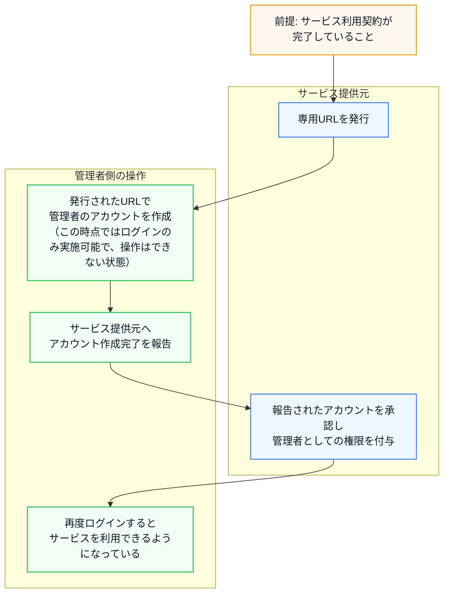

# LoopLive 操作手順書

LoopLive Web アプリの操作手順を、管理者向けとユーザー向けの2ページ構成で定義する。

## サービスが利用できるようになるまで

### 補足（ユーザーアカウント運用）

- ユーザーを追加する場合は、発行済みURLをユーザーへ共有してアカウントを作成してもらい、管理者が `ユーザー管理` 画面で承認（権限付与）する。
- ユーザーが離任した場合は、管理者がユーザーアカウントを停止または削除できる。

---

## A. 管理者向け手順書（`docs/admin.html` 想定）

### A-1. 初期設定（管理者）

#### A-1-1. 目標

- 管理者自身のアカウントを作成できる
- サービス提供元による有効化待ちまで完了できる

#### A-1-2. 手順

| No | 画面 | 操作 | 結果確認 |
|---:|---|---|---|
| 1 | ログイン画面 | LoopLive の URL にアクセスし、`アカウント作成` タブを選択する | サインアップ画面が表示される |
| 2 | サインアップ | `LoopLive 利用規約` が表示されるので、`利用規約を最後までスクロールしてご確認ください。` が消えるまでスクロールする | `同意する` が有効になる |
| 3 | 利用規約ダイアログ | `同意する` を押す | サインアップ入力フォームが表示される |
| 4 | サインアップ | `Email`（形式が正しい）と `パスワード`（8文字以上）を入力する | 入力が受け付けられる |
| 5 | サインアップ | `アカウントを作る` を押す | アカウントが作成される |
| 6 | （運用ルール） | アカウント作成後、サービス提供元に連絡して有効化されるまで待つ | 有効化完了後に利用開始できる |

### A-2. 配信者を追加する（管理者）

#### A-2-1. 目標

- 配信者がアカウント作成できる
- 管理者が配信者に必要な権限と顔画像設定を反映できる

#### A-2-2. 手順

| No | 画面 | 操作 | 結果確認 |
|---:|---|---|---|
| 1 | （配信者側）ログイン画面 | 配信者に `A-1 初期設定` と同様の手順でアカウント作成してもらう | 配信者アカウントが作成される |
| 2 | `PortalPage` | `ユーザーを管理する` を押す | `UserManagementPage` が表示される |
| 3 | `UserManagementPage` | 追加対象の配信者カードをクリックする | `ユーザー詳細` が表示される |
| 4 | `ユーザー詳細` | `編集` を押す | `ユーザー編集` が表示される |
| 5 | `ユーザー編集` | `権限` を選択する（一般 / クリエイター。 [権限の一覧](#c-2-ロールと行える操作) を参照） | 権限の選択が反映される |
| 6 | `ユーザー編集` | 顔画像（`source_file`）を設定する | 顔画像設定が反映される |
| 7 | `ユーザー編集` | `更新` を押す | 配信者の設定が保存される |

### A-3. 写真フェイススワップ（管理者）

#### A-3-1. 目標

- `フェイススワップする` が完了し、`処理履歴` に `完了` が表示される
- `結果` を `ダウンロード` できる

#### A-3-2. 手順

| No | 画面 | 操作 | 結果確認 |
|---:|---|---|---|
| 1 | `PhotoFaceSwapPage` | `元の顔を選択` で画像（JPG/PNG）をアップロード | プレビューが表示される |
| 2 | `PhotoFaceSwapPage` | `なりたい顔を選択` で画像（JPG/PNG）をアップロード | プレビューが表示される |
| 3 | `PhotoFaceSwapPage` | `フェイススワップする` を押す | 確認ダイアログが表示される |
| 4 | 確認ダイアログ | `はい` を押す | `処理中です...` が表示される |
| 5 | `PhotoFaceSwapPage` | `処理履歴` の最新行に追加されるのを待つ | ステータスが表示される |
| 6 | `処理履歴` | ステータスが `完了` になるまで待つ | `完了` のチップが表示される |
| 7 | `処理履歴` | `結果` のダウンロード（PC: 下矢印 / スマホ: `ダウンロード`）を押す | 結果画像が表示または保存される |

### A-4. 利用料金を確認する（管理者）

#### A-4-1. 目標

- 対象月の利用時間・請求金額を確認できる
- サーバー別の起動/停止履歴を確認できる

#### A-4-2. 手順

| No | 画面 | 操作 | 結果確認 |
|---:|---|---|---|
| 1 | `PortalPage` | `サーバー使用料を見る` を押す | `UsageBillingPage` が表示される |
| 2 | `UsageBillingPage` | `合計利用時間` と `合計請求金額` を確認する（対象月は矢印で切替） | 月次の合計が確認できる |
| 3 | `UsageBillingPage` | 明細テーブルでサーバー行をクリックする | `利用履歴` ダイアログが開く |
| 4 | 利用履歴ダイアログ | 一覧を確認する | 起動/停止履歴が確認できる |
| 5 | `UsageBillingPage` | `フォトスワップ使用` の枚数を確認する | `XX枚` が表示される |

**表示メモ（画面キャプチャ）**: 静的ページ化時は、「合計値と明細を確認」「利用履歴とフォトスワップ使用枚数」のカード画像はそれぞれ1枚ずつでよい。

### A-5. ユーザー情報を変更する（管理者）

#### A-5-1. 目標

- ユーザーの検索・編集・削除ができる

#### A-5-2. 手順

| No | 画面 | 操作 | 結果確認 |
|---:|---|---|---|
| 1 | `PortalPage` | `ユーザーを管理する` を押す | `UserManagementPage` が表示される |
| 2 | `UserManagementPage` | 検索欄（`名前、ID、またはEmailで検索...`）に条件を入力 | 一覧が絞り込まれる |
| 3 | `UserManagementPage` | 対象ユーザーカードをクリックする | `ユーザー詳細` が表示される |
| 4 | `ユーザー詳細` | `編集` を押す | `ユーザー編集` が表示される |
| 5 | `ユーザー編集` | `ユーザー名` / `Email` / `パスワード` / `権限` を必要に応じて更新する | 入力内容が反映される |
| 6 | `ユーザー編集` | `更新` を押す | ユーザー一覧に反映される |
| 7 | `ユーザー詳細` | `削除` を押し、確認ダイアログで `はい` を押す | ユーザーが一覧から消える |

---

## B. ユーザー向け手順書（`docs/user.html` 想定）

### B-1. アカウント作成方法（ユーザー）

#### B-1-1. 目標

- ユーザーが自身のアカウントを作成できる

#### B-1-2. 手順

| No | 画面 | 操作 | 結果確認 |
|---:|---|---|---|
| 1 | ログイン画面 | LoopLive の URL にアクセスし、`アカウント作成` タブを選択する | サインアップ画面が表示される |
| 2 | サインアップ | `LoopLive 利用規約` を最下部までスクロールする | `同意する` が有効になる |
| 3 | 利用規約ダイアログ | `同意する` を押す | サインアップ入力フォームが表示される |
| 4 | サインアップ | `Email` と `パスワード` を入力する | 入力が受け付けられる |
| 5 | サインアップ | `アカウントを作る` を押す | アカウントが作成される |

**補足**: アカウントを作成しただけでは使用可能になりません。管理者にアカウントの有効化（権限設定）を依頼してください。

### B-2. リアルタイム加工（ユーザー）

#### B-2-1. 目標

- `加工開始` から `加工停止` まで実行できる
- 必要に応じて `加工後の映像を見る` で出力を確認できる

#### B-2-2. 手順

| No | 画面 | 操作 | 結果確認 |
|---:|---|---|---|
| 1 | `PortalPage` | `加工を始める` を押す | `サーバー管理` 画面が表示される |
| 2 | `InstanceDashboard` | 対象サーバーで `入室` を押す | `StreamingPage` が開く |
| 3 | `StreamingPage` | サーバー状態が `OFF` / `起動失敗` の場合は `起動する` を押す | 確認ダイアログが表示される |
| 4 | 確認ダイアログ | `はい` を押す | `サーバーを起動しています。このままお待ちください...` が表示される |
| 5 | `StreamingPage` | サーバー状態が `準備完了` になるまで待つ | `カメラに接続` が押せる状態になる |
| 6 | `StreamingPage` | `カメラに接続` を押す | プレビューにカメラ映像が表示される |
| 7 | `StreamingPage` | 必要に応じて `カメラ` を選び直す | 映像が切り替わる |
| 8 | `StreamingPage` | 必要に応じて鼻下加工を切り替える | 表示が切り替わる |
| 9 | `-`（OBS側の操作） | OBS Studioを起動し、OBS側で WebSocketサーバーを有効にし、`サーバーパスワード` を発行、コピー | 参考：https://help.alive-project.com/hc/ja/articles/38077288641555-OBS-WebSocket%E3%81%AE%E8%A8%AD%E5%AE%9A%E6%96%B9%E6%B3%95 |
| 10 | `StreamingPage` | `OBS WebSocketパスワード` 欄に9.サーバーパスワードを入力する | LoopLive→OBS Studioに映像を連携させるために必要なパスワード |
| 11 | `StreamingPage` | `OBS連携` 欄の設定を必要に応じて変更する | マイクの遅延、ネットワークバッファリング、出力ストリームのレイテンシ |
| 12 | `StreamingPage` | `OBSにメディアソースを追加` ボタンを押し、OBS側の`ソース`欄に`LoopLiveからの映像`が追加されたことを確認 | OBS Studioが起動している事が必須。パスワードのダイアログが出たら、`はい`を選択して保存しておくと便利 |

よくあるエラー

| エラー文 | 想定される原因 | どうすればいいか |
|---|---|---|
| 再生用のURLが指定されていません。 | 配信準備が済む前に操作した、サーバー側で URL が未設定など。 | サーバーが起動してしばらくしてから操作する。 |
| OBSからシーンリストを取得できませんでした。 | OBS にシーンが1つも設定されていない。 | OBS でシーンを少なくとも1つ作成してから再試行する。 |
| 最後のシーンの名前が取得できませんでした。 | まれに起こる。 | まれなケース。OBS を再起動し、再度同じ手順を実施する。 |
| OBSのWebSocketパスワードが正しくありません。 | OBS 側の WebSocket 認証と、LoopLive に入力したパスワードが一致しない。 | OBS の「設定」→「WebSocket サーバー」のサーバーパスワードと、入力した `OBS WebSocketパスワード` を一致させる。 |
| OBS WebSocketパスワードは必須です。 | パスワードが記入されていない。 | LoopLive にパスワードを入力する。 |
| OBSがリクエストを無効と判断しました。OBS側の環境に問題がある可能性があります。 | OBS側の不具合。 | OBS のバージョンを確認・更新する。OBS を再起動し、プラグインの影響を疑う。 |
| OBSに接続できません。OBSが起動しているか、WebSocketサーバー設定を確認してください。 | OBSに接続失敗している。 | 同一 PC で OBS Studio を起動する。OBS の WebSocket サーバーを有効にし、既定のポート **4455** で待ち受けているか確認する。ファイアウォールやセキュリティソフトの設定が妨害していないかを確認する。ポート **4455** を別アプリが使用していないかを確認する。 |
| 予期せぬエラーが発生しました。詳細はコンソールを確認してください。 | 上記の個別分岐に当てはまらない例外。 | 開発元へ相談する。 |

**補足（エラーではないが表示されうるメッセージ）**

| 表示 | 想定される原因 | どうすればいいか |
|---|---|---|
| ソースは設定しましたが、マイクの遅延設定には失敗しました。 | 映像の受信設定は成功しているが、 `マイク` が OBS に存在しないため設定に失敗した。 | OBS のマイクの名を `マイク` に修正し再度ボタンを押す。 |

うまくいかないとき（加工開始〜加工が始まるまで）

**ボタンが押せない・灰色のまま**

| 状況 | 想定される原因 | どうすればいいか |
|---|---|---|
| `加工開始` が押せない | カメラがまだ接続されていない。 | 手順6まで戻り、`カメラに接続` からプレビューが出る状態にする。 |
| 同上 | サーバーの状態が「準備完了」ではない（起動処理中・準備中・停止処理中・オフなど）。 | 手順3〜5のとおり、起動が完了して **準備完了** になるまで待つ。 |

**メッセージが出る場合（通知など）**

| 目安となる表示 | 想定される原因 | どうすればいいか |
|---|---|---|
| カメラまたはサーバー接続情報がありません。 | カメラ映像の取得が無い、またはサーバー側の接続先情報がまだ画面に揃っていない。 | `カメラに接続` をやり直す。ページを再読み込みし、**準備完了** を確認してから再度 `加工開始` する。 |
| サーバーへの接続に失敗しました（のあとに英語や数字が続くことがある） | ブラウザからサーバーへの最初の接続確立に失敗した。 | 通信環境を確認する。時間を置いて再試行する。VPN・プロキシ・企業ネットワークの制限も疑う。 |
| サーバーとの接続が確立しました。加工の処理を開始します…（のち長く待つ） | 接続はできたが、サーバー側で加工用の映像出力の準備に時間がかかっている。 | **数分待つ**ことがある。エラーではない場合が多い。 |
| 加工処理中… ／ 接続中… が長い | 上記の準備待ち、または通信が遅い。 | 待つ。5分近く待っても進まない場合は、下のタイムアウトや接続切れを参照。 |
| 加工処理がタイムアウトしました（300秒）。 | 約5分以内に加工の準備完了にならなかった。 | `加工停止` でいったん止め、ネットワークとサーバー状態を確認してからやり直す。改善しない場合はサービス提供元に相談する。 |
| サーバー状態の確認に失敗しました。 | 加工準備が整ったかどうかの確認の通信に失敗した。 | 通信を確認し、ページを再読み込みしてからやり直す。 |
| サーバーとの接続が切れました。 | 通信が途中で切断された。 | ネットワークを確認し、あらためて `加工開始` から試す。 |
| サーバー情報の更新に失敗しました。 | 画面の裏側でサーバー情報の取得に失敗した（加工中以外でも出うる）。 | 通信を確認。繰り返す場合はページを再読み込み。 |

**エラーが出なくても起きうること**

| 状況 | 想定される原因 | どうすればいいか |
|---|---|---|
| `はい` を押したあと **準備完了** のままに見える／すぐには進まない | 表示の更新タイミングや、サーバー側の処理待ち。 | しばらく待つ。手順書「補足（所要時間）」も参照。 |
| `加工処理中…` のあとも OBS にすぐ映らない | 本画面で加工が始まっても、OBS 側に映像が届くまで追加で時間がかかる。 | 数十秒〜1分程度待つ（手順15の説明どおり）。 |

| No | 画面 | 操作 | 結果確認 |
|---:|---|---|---|
| 13 | `StreamingPage` | `加工開始` を押す | 確認ダイアログが表示される |
| 14 | 確認ダイアログ | `はい` を押す | `加工処理中…`（または一時的に `接続中...`）になる |
| 15 | `StreamingPage` | `使用中` が表示されれば成功 | 加工が開始される。加工が開始されてからおよそ数十秒～1分程度でOBS Studioにも映像が映る |
| 16 | `StreamingPage` | 必要に応じて `加工後の映像を見る` を押す | 別タブで加工映像が表示される |
| 17 | `StreamingPage` | 加工を終了するときは `加工停止` を押す | |
| 18 | `StreamingPage` | '停止する'ボタンを押す | 数分～10分程度で `OFF` に戻る。終了時に `停止する` を押さずに閉じると、サーバー稼働が継続して利用料が発生する可能性がある。必ず停止完了（`OFF`）まで確認する。 |

#### B-2-3. 補足（所要時間）

- **起動の確認〜準備完了（手順4〜5）**: `はい` 押下後、ステータスは **`起動処理中` → `準備中` → `準備完了`** の順で遷移し、`準備完了` になるまで数分かかることがある。
- **カメラ接続〜加工処理中（手順6〜11）**: カメラ接続後に `加工開始` → `はい` を押しても、`準備完了` のまま数分待つ場合がある。`加工処理中…` になっても **OBS へ映像が届くまでさらに約1分** かかることがある。
- **加工停止〜OFF（手順13〜停止完了）**: `加工停止` 後にサーバー停止を行った場合、**`停止処理中` → `OFF`** まで数分、長いと10分程度かかることがある。
- **料金に関する注意**: 終了時に `停止する` を押さずに閉じると、サーバー稼働が継続して利用料が発生する可能性がある。必ず停止完了（`OFF`）まで確認する。

---

## C. 共通情報（用語・画面・権限）

### C-1. 画面の表示名と内部名・ルート

| ユーザー向け表示名 | 内部名（実装） | ルート |
|:---|:---|:---|
| ポータル（トップ） | `PortalPage` | `/` |
| リアルタイム加工 | `StreamingPage` | `/streaming/:instanceId` |
| 写真フェイススワップ | `PhotoFaceSwapPage` | `/photo-face-swap` |
| 利用料金 | `UsageBillingPage` | `/usage-billing` |
| ユーザー管理 | `UserManagementPage` | `/users` |
| プロフィール | `ProfilePage` | `/profile` |

### C-2. ロールと行える操作

| 画面上の権限 | 行える操作の概要 |
|:---|:---|
| 一般 | 加工の開始・停止 |
| クリエイター | 加工の開始・停止、写真フェイススワップ |
| 運用 | 加工の開始・停止、写真フェイススワップ、ユーザー管理、利用料金の確認 |